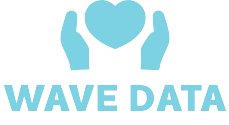
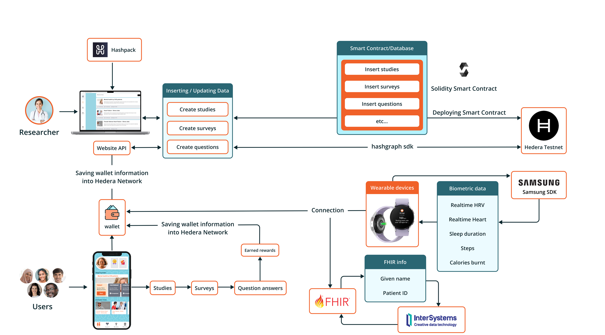

  

# WaveData

## Track
Hashgraph Trailblazers

## Introduction	
### Summary:
WaveData: Decentralized marketplace for clinical trials with the power of Hedera. WaveData is based on two things: (1) Decentralized marketplace where organizations (universities/hospitals/pharma) can create a clinical trial and also get data from the people that join the clinical trial (2) App that people will use during the clinical trial, get recommendations in which trials they can participate and get credits/vouchers in their own personal wallet.

### Problem to be solved - solution
See the presentation that we made for the project: 
 
https://docs.google.com/presentation/d/1Q2_CcezOIo8uxUtKFTfQDA7OVMANAKCL/edit?usp=sharing&ouid=101559367215941846840&rtpof=true&sd=true

### Inspiration
In our society we see that artificial intelligence (AI) is everywhere and is already making important decisions in our daily life. AI can create many positive impacts, but we also have big challenges like racist decisions. Most things in our society are built for, and designed around, a specific “reference man." This “standard human” is usually a white male in his 30s who weighs around 155 pounds. The reference man is the default user in many parts, like cars, air-conditioned offices, city streets and especially healthcare. When it comes to healthcare, we see that it has deadly effects for women and BAME. 

A big problem is that we need inclusive data to create inclusive AI modules, however medical researchers have a hard time finding people and convincing them to share their health data. People are however very eager to help when they realize their data can make a difference. This works even better with diseases they have a connection to through a family member or a friend.
The global clinical trials market size was estimated at USD 44.3 billion in 2020 and is expected to expand at a compound annual growth rate (CAGR) of 5.7% from 2021 to 2028. As an inclusive team, we want to change this with WaveData - Your data is the cure! WaveData offers a secure way to share your data from wallet to wallet, so you can control yourself and help find a cure!
### What it does
WaveData is based on two things: (1) Decentralized marketplace where organizations (universities/hospitals/pharma) can create a clinical trial and also get data from the people that join the clinical trial (2) App that people will use during the clinical trial, get recommendations in which trials they can participate and get credits/vouchers.

WaveData connects people who want to help with medical researchers who need data. The biggest difference with existing platforms is that we approach the problem from the side of the people who want to help cure a disease. When someone you love has cancer or Alzheimers you feel helpless, and you want to do something about it. WaveData is built on the Hedera to provide a safe and secure way to share your data. We can see that pharmaceutical companies would be interested in the same data. It's up to you if you give them permission to look at your data. You can earn HBAR by sharing your data in that way. You can keep that benefits for yourself or donate it to help cure the disease of your choice.

### The market
The global clinical trials market size was estimated at USD 44.3 billion in 2020 with over 400.000 clinical trials and is expected to expand at a compound annual growth rate (CAGR) of 5.7% from 2021 to 2028. Both medical facilities, universities and Pharmaceutical Companies are looking desperately for a way to fill in that demand. WaveData allows them to find and connect to diverse groups of participants while avoiding the mistrust the general population may have for these institutions and companies.

### The benefits of WaveData for these institutions and companies are:
1. Ease of use: On the WaveData platform researchers can easily post clinical trials,
including the details, surveys, goals, rewards etc. The platform does the rest: connecting them to participants, facilitating the sharing of the data, securing the data etc.
2. Reusing data sets: Often researchers are looking for the same data. For example, researchers into heart disease may be looking for lifestyle data of women of 45+y. Meanwhile researchers into diabetes are looking for exactly the same data. Instead of competing for participants for their trials, these researchers can use the same data by using the WaveData platform. The trials don’t even have to be run simultaneous. The longer the platform is running the more validated and diverse data-sets will become available.
3. Large, diverse pool of possible participants: The ease of use of WaveData and the personal way it connects to possible participants opens up the pool of participants considerably when compared to the current way of finding subjects which led to the problematic “Reference man”. A more diverse group of participants will lead to more inclusive data that can be used to develop better algorithms, healthcare decisions and solutions.

### Crucial stakeholder motivation
1. Medical research facilities - we help them connecting to people who are willing to share their data
2. Patients' interests’ associations - give them an opportunity to combat the disease through the sharing of data.
3. Pharmaceutical Companies - an opportunity to have access to data if allowed by the people
4. Everybody - a way to help combat diseases that can be trusted because your personal data are secure
5. Government - Aiding healthcare research through robust security for personal data

## Technology
### Integrations
We have integrated Hashpack wallets connection. Then we have created a solidity smart contract and deployed it to the Hedera testnet network. Then using hedera sdk reading state and calling Transaction. We have a website, api and app. In the website, researchers make studies, informed consents, surveys, and questions. These are being saved into smart contracts. Then in the api we are calling and reading information using a derived account. We have used that api into the app. We have made a reward system.  When patients complete a survey, they get the  reward offered by researchers. Patient can withdraw the amount  to his wallet. We have integrated FHIR with Intersystems. In the app patients provide their Fhir Identifier and given name. We retrieve patient information from FHIR. We have also integrated the Samsung SDK. Users can connect to his wear os device and they can see their real time data in the app.

**About FHIR:** The biggest systems, like Epic, Cerner and ChipSoft are using FHIR as the main standard for data sharing. (Fast Healthcare Interoperable Resources, makes it possible to connect various building blocks to a complete patient overview on all thinkable domains within healthcare).

**Features:**
1.  Study: Researchers can create, update studies on the website. 
2.  Survey: Inside Study there are surveys. To create a survey researchers need to give a reward price. In the app, when a patient completes the survey then  the user earns that reward.
3. Informed Consent: In the Study there has a section for informed consent. Researchers need to add titles by age groups, and information  with Yes/No, Next/Prev other things. In the app, before joining a study informed consent is asked. There, the user has to provide a signature.
4. Wearable: Patients can connect their Samsung wearable into the app.
5. Cashout: Patients can cash out their rewards to hedera wallet address.

**How it works:**
WaveData connects people who want to help with medical researchers who need data. The biggest difference with existing platforms is that we approach the problem fromt the side of the people who want to help cure a disease. WaveData has 2 roles: Organizer and users/patients.

With the WaveData marketplace the organizer can create their studies and surveys and set the questions, rewards etc. With the WaveData app, peoople can download a user-friendly app to survey and join studies.

WaveData helps each user and organizer to keep touch everyday. On WaveData the organizer can check how many people have contributed and what their answers are. WaveData provides chart analysis options for the organizer to keep updated with better understanding.

For wavedata, we are using Hedera to store user's details, study details, Rewards details (for each Study), Survey, Audiences, Contributors and retirieving those in our website.

**Next Steps integration with Hedera:**
1. Integrate Metamask
2. Integrate Charts of survey users
3.  Integrate Clinical Outcome Section in study
4. Chatbot in informed Consent
5. Live chat between Patient and Researchers.
6. Deploy to Mainnet

## Architect
Hedera, Solidity, Hardhat, Testnet, Typescript, Javascript, Api, Next js, Hashpack 

## Team info
1. **Daryl:** Founder Wavy Health, Inc. AI expert, ex-lead data scientist, 2 MScs: Econometrics and Finance. Blockchain, AI and mobile development
1. **Steve:** Founder Wavy Health, Inc. Technical innovation researcher, stakeholder management, won over 50 worldwide competitions
2. **Vinay**: Blockchain developer, full stack
3. **Sigrid**: Design, UX/UI, animator, healthcare

## Special to know
Wavy Health Inc. won a European grant of 22.6 million together with universities, patients organizations and hospitals to improve treatment and medication. The six leading pharma companies in the world are in the consortium.

Wavy Health Inc. has a collaboration with Samsung where we have access to the Samsung SDK. Only 300 companies in the world have this approval. With the SDK we can get data on sensor level from the Samsung wearables.

### Development
Wavedata is made using React js. We are using hashconnect and @hashgraph/sdk to connect with Hashpack wallet. We are using Hedera testnet network. We have made our smart contract into solidity language. Then using hardhat we have deployed using hedera mirror/hashio rpc url. In order to avoid view functions query fees, we are using ether.js. And then for the send transaction we are using @hashgraph/sdk or Hashpack wallet.

1. Soldity Smart contract written in [WaveData.sol](./wavedata/src/contracts/contracts/WaveData.sol)
2. Hardhat deploying  js file written in [deploy.js](./wavedata/src/contracts/deploy/deploy.js) and [hardhat.config.js](./wavedata/src/contracts/hardhat.config.js) 
3. We have used Hashconnect client in [hashconnect-client.js](./wavedata/src/contextx/hashconnect-client.js)
4. We have used [hashconnect.js](./wavedata/src/services/hashconnect.js) 
5. We have used redux storing hashpack accounts in [store.js](./wavedata/src/services/store.js)
6. We have used Etherjs contract to avoid view functions call gas fee in [useContract.js](./wavedata/src/services/useContract.js)
7. We have used Connect Wallet in [Login page](./wavedata/src/pages/LogIn.js)
8. We have used Connect Wallet in [Register page](./wavedata/src/pages/Register.js)
9. We are retrieving View functions using usecontract.js. example : [LoadData()](./wavedata/src/pages/Study.js)
10. We are using [CreateStudy](./wavedata/src/components/modal/CreateStudy.jsx), [CreateSurvey](./wavedata/src/components/modal/CreateSurvey.jsx), [UpdateStudy](./wavedata/src/components/modal/UpdateStudy.jsx), [UpdateSurvey](./wavedata/src/components/modal/UpdateSurvey.jsx) for send transaction.  

## WaveData App (Development)
Wavedata App is made using flutter. We are using wavedata-api for making connection between hedera network and wavedata flutter app. 

## WaveData Api (Development)
Wavedata Api is made using nextjs. We have depolyed it into vercel. Then we are using it's url to wavedata app. In the api, we are using a derieved privatekey for making transaction. Also we are using ether.js here for viewing functions.

## Instructions

### To run Website:
1. Go to wavedata folder
2. if you haven't installed nodejs. Then you have to first install node js. Link of download  https://nodejs.org/en/download/
3. Then run 'npm install' in that wavedata folder.
4. Then run 'npm run build'. 
5. Next you have to 'npm run dev' to run locally. Then, you can test the website at http://localhost:3000/

### To run app:
1. Go to wavedata-app folder.
2. Now you have to install flutter. https://docs.flutter.dev/get-started/install
3. When you have done setup with Flutter, then you can run 'flutter run -d chrome'. It will open a chrome browser and it will be localhost. There you can test the app.

### To run Website Api:
1. Go to wavedata-api folder
2. if you haven't installed nodejs. Then you have to first install node js. Link of download  https://nodejs.org/en/download/
3. Then run 'npm install' in that wavedata-api folder.
4. Then run 'npm run build'. 
5. Next you have to 'npm run dev' to run locally. Then, you can test the website at http://localhost:3000/

## Material for Demo

### Presentation
For more information, please see the presentation
 
https://docs.google.com/presentation/d/1Q2_CcezOIo8uxUtKFTfQDA7OVMANAKCL/edit?usp=sharing&ouid=101559367215941846840&rtpof=true&sd=true

### Pitch Video Link
https://vimeo.com/1040614126?share=copy

### Testimonials
Prof. dr. Angela Maas and Prof. dr. Petra Elders
 
https://vimeo.com/1040538338?share=copy

### Demo Links
Website: https://wavedata-hedera.vercel.app/
 
App: https://wavedata-hedera-app.vercel.app/#/

**NB:** You can register free account